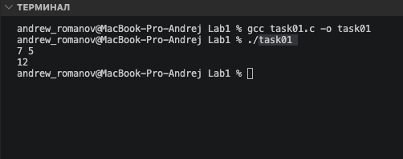
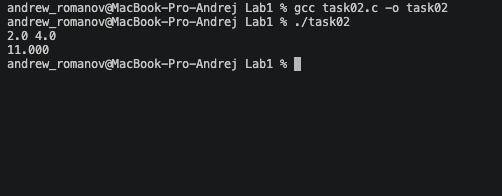
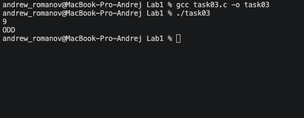
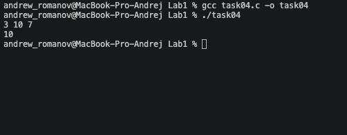
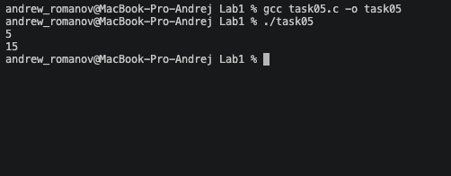
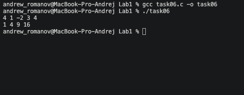
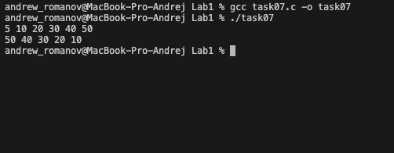

# Тема лабораторной работы: Основы С

## Задача 1: Сумма двух чисел (task01.c)

**Постановка задачи**
Цель: отработать ввод/вывод и переменные типа int.
Вход: два целых числа а и b.
Выход: их сумма.
Ограничения: 10000 <= a, b <= 10000.
Пример: Ввод: 7 5.
Вывод: 12.

**Математическая модель**
S = a + b

**Список идентификаторов**
| Имя переменной | Тип данных | Смысловое обозначение |
|----------------|------------|-----------------------|
| a | int | Первое слагаемое |
| b | int | Второе слагаемое |

**Код программы**

```c
#include <stdio.h>

int main() {
    int a, b;
    scanf("%d %d", &a, &b);
    printf("%d\n", a + b);
    return 0;
}
```



## Задача 2: Простая формула (task02.c)

**Постановка задачи**
Цель: вычислить математическое выражение с double.
Формула: $u=(x+y)/2+x^{*}y$
Вход: два вещественных числа х, у.
Выход: значение и с точностью 3 знака после запятой.
Ограничения: $100.0<=x, y<=100.0.$
Пример: Ввод: 2.0 4.0. Вывод: 11.000.

**Математическая модель**
$$u = \frac{x+y}{2} + x \cdot y$$

**Список идентификаторов**
| Имя переменной | Тип данных | Смысловое обозначение |
|---|---|---|
| `x` | `double` | Первое вещественное число |
| `y` | `double` | Второе вещественное число |
| `u` | `double` | Результат вычисления формулы |

**Код программы**

```c
#include <stdio.h>

int main() {
    double x, y;
    scanf("%lf %lf", &x, &y);
    double u = (x + y) / 2.0 + x * y;
    printf("%.3lf\n", u);
    return 0;
}
```



## Задача 3: Проверка чётности (task03.c)

**Постановка задачи**
Цель: использовать условный оператор if.
Вход: целое число n.
Выход: EVEN, если число чётное, иначе ODD.
Ограничения: $|n|<=1000000$.

**Математическая модель**
Для проверки чётности используется операция получения остатка от деления на 2. Если $n \pmod 2 = 0$, число чётное.

**Список идентификаторов**
| Имя переменной | Тип данных | Смысловое обозначение |
| :--- | :--- | :--- |
| n | int | Проверяемое число |

**Код программы**

```c
#include <stdio.h>

int main() {
    int n;
    if (scanf("%d", &n) == 1) {
        if (n % 2 == 0) {
            printf("EVEN\n");
        } else {
            printf("ODD\n");
        }
    }
    return 0;
}
```



## Задача 4: Максимум из трёх (task04.c)

**Постановка задачи**
Цель: сравнение нескольких значений через if.
Вход: три целых числа a, b, c.
Выход: максимальное число.
Ограничения: $|a|, |b|, |c| <= 1000000$.

**Математическая модель**
Последовательное сравнение: $\max = a$; если $b > \max$, то $\max = b$; если $c > \max$, то $\max = c$.

**Список идентификаторов**
| Имя переменной | Тип данных | Смысловое обозначение |
| :--- | :--- | :--- |
| a, b, c | int | Исходные числа |
| max | int | Максимальное из чисел |

**Код программы**

```c
#include <stdio.h>

int main() {
    int a, b, c;
    if (scanf("%d %d %d", &a, &b, &c) == 3) {
        int max = a;
        if (b > max) {
            max = b;
        }
        if (c > max) {
            max = c;
        }
        printf("%d\n", max);
    }
    return 0;
}
```



## Задача 5: Сумма от 1 до n (task05.c)

**Постановка задачи**
Цель: цикл for.
Вход: целое число n.
Выход: сумма $1+2+...+n$.
Ограничения: $1<=n<=10000$.
Пример: Ввод: 5. Вывод: 15.

**Математическая модель**
$S = \sum_{i=1}^{n} i$

**Список идентификаторов**
| Имя переменной | Тип данных | Смысловое обозначение |
| :--- | :--- | :--- |
| n | int | Верхняя граница суммы |
| sum | int | Накапливаемая сумма |
| i | int | Счётчик цикла |

**Код программы**

```c
#include <stdio.h>

int main() {
    int n;
    if (scanf("%d", &n) == 1) {
        int sum = 0;
        for (int i = 1; i <= n; i++) {
            sum += i;
        }
        printf("%d\n", sum);
    }
    return 0;
}
```



## Задача 6: Квадраты элементов массива (task06.c)

**Постановка задачи**
Цель: работа с одномерным статическим массивом.
Вход: число n, затем n целых чисел.
Выход: n чисел — квадраты элементов в том же порядке.
Ограничения: $1<=n<=100$, $|a[i]|<=1000$.

**Математическая модель**
Возведение в квадрат каждого элемента массива: $a_i = a_i \cdot a_i$.

**Список идентификаторов**
| Имя переменной | Тип данных | Смысловое обозначение |
| :--- | :--- | :--- |
| n | int | Количество элементов массива |
| a | int[] | Массив чисел |
| i | int | Счётчик цикла |

**Код программы**

```c
#include <stdio.h>

int main() {
    int n;
    if (scanf("%d", &n) == 1) {
        int a[100];
        for (int i = 0; i < n; i++) {
            scanf("%d", &a[i]);
        }
        for (int i = 0; i < n; i++) {
            printf("%d ", a[i] * a[i]);
        }
        printf("\n");
    }
    return 0;
}
```



## Задача 7: Разворот массива (task07.c)

**Постановка задачи**
Цель: индексация массива и вывод элементов в обратном порядке.
Вход: число n, затем n целых чисел.
Выход: элементы в обратном порядке.
Ограничения: $1<=n<=100$, $|a[i]|<=1000$.

**Математическая модель**
Перебор индексов массива в обратном порядке: от $n-1$ до $0$.

**Список идентификаторов**
| Имя переменной | Тип данных | Смысловое обозначение |
| :--- | :--- | :--- |
| n | int | Количество элементов массива |
| a | int[] | Массив чисел |
| i | int | Счётчик цикла |

**Код программы**

```c
#include <stdio.h>

int main() {
    int n;
    if (scanf("%d", &n) == 1) {
        int a[100];
        for (int i = 0; i < n; i++) {
            scanf("%d", &a[i]);
        }
        for (int i = n - 1; i >= 0; i--) {
            printf("%d ", a[i]);
        }
        printf("\n");
    }
    return 0;
}
```



## Информация о студенте

Зубанов Андрей, 1 курс, группа ИВТ.
