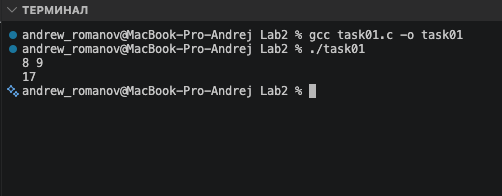
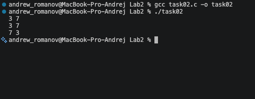
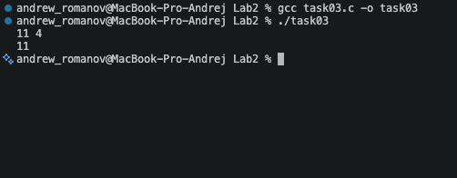
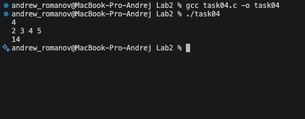
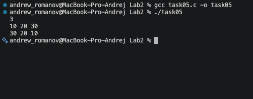
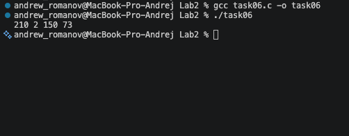
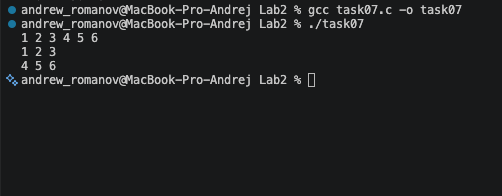

# Тема лабораторной работы: Указатели и динамическая память

## Задача 1: Сложение через указатели (task01.c)

**Постановка задачи**
Цель: получить значение переменных через указатели.
Вход: два целых числа a, b. [cite: 2313]
Выход: сумма чисел. [cite: 2314]
Требование: складывать значения через указатели `int *pa`, `int *pb`.

**Математическая модель**
$S = a + b$, где обращение к значениям $a$ и $b$ происходит через разыменование указателей: $*pa$ и $*pb$.

**Список идентификаторов**
| Имя переменной | Тип данных | Смысловое обозначение |
| :--- | :--- | :--- |
| a, b | int | Слагаемые |
| pa, pb | int\* | Указатели на слагаемые |

**Код программы**

```c
#include <stdio.h>

int main(void) {
    int a, b;
    int *pa = &a;
    int *pb = &b;

    if (scanf("%d %d", &a, &b) == 2) {
        printf("%d\n", *pa + *pb);
    }

    return 0;
}
```



## Задача 2: Обмен двух чисел (task02.c)

**Постановка задачи**
Цель: изменить данные по адресу (swap).
Вход: два целых числа a, b.
Выход: сначала исходные, затем обменённые значения.
Требование: обмен выполнять через указатели.

**Математическая модель**
Обмен значений переменных производится с использованием дополнительной переменной `temp` и разыменования указателей:
`temp = *pa`
`*pa = *pb`
`*pb = temp`

**Список идентификаторов**
| Имя переменной | Тип данных | Смысловое обозначение |
| :--- | :--- | :--- |
| a, b | int | Исходные числа |
| pa, pb | int\* | Указатели на числа |
| temp | int | Временная переменная для обмена |

**Код программы**

```c
#include <stdio.h>

int main(void) {
    int a, b;
    int *pa = &a;
    int *pb = &b;

    if (scanf("%d %d", &a, &b) == 2) {
        printf("%d %d\n", *pa, *pb);

        int temp = *pa;
        *pa = *pb;
        *pb = temp;

        printf("%d %d\n", *pa, *pb);
    }

    return 0;
}
```



## Задача 3: Максимум через указатели (task03.c)

**Постановка задачи**
Цель: условие с обращением по указателю.
Вход: два целых числа.
Выход: максимальное из них.
Требование: сравнивать значения через указатели.

**Математическая модель**
Определение максимума: если $*pa > *pb$, то результат $*pa$, иначе результат $*pb$.

**Список идентификаторов**
| Имя переменной | Тип данных | Смысловое обозначение |
| :--- | :--- | :--- |
| a, b | int | Сравниваемые числа |
| pa, pb | int\* | Указатели на числа |

**Код программы**

```c
#include <stdio.h>

int main(void)
{
    int a, b;
    int *pa = &a;
    int *pb = &b;

    if (scanf("%d %d", &a, &b) == 2)
    {
        if (*pa > *pb)
        {
            printf("%d\n", *pa);
        } else
        {
            printf("%d\n", *pb);
        }
    }

    return 0;
}
```



## Задача 4: Динамический массив и сумма (task04.c)

**Постановка задачи**
Цель: выделить память под массив и пройти его указателем.
Вход: число n, затем n целых чисел.
Выход: сумма всех элементов.
Ограничения: $1 <= n <= 1000$.
Требование: обход элементов через арифметику указателей.

**Математическая модель**
Сумма элементов массива: $S = \sum_{i=0}^{n-1} *(arr + i)$, где $(arr + i)$ — адрес $i$-го элемента.

**Список идентификаторов**
| Имя переменной | Тип данных | Смысловое обозначение |
| :--- | :--- | :--- |
| n | int | Количество элементов |
| arr | int\* | Указатель на начало динамического массива |
| sum | int | Сумма элементов |
| i | int | Счётчик цикла |

**Код программы**

```c
#include <stdio.h>
#include <stdlib.h>

int main(void)
{
    int n;
    if (scanf("%d", &n) != 1 || n <= 0)
        return 1;

    int *arr = (int *)malloc((size_t)n * sizeof(int));
    if (arr == NULL)
        return 1;

    for (int i = 0; i < n; i++)
    {
        scanf("%d", (arr + i));
    }

    int sum = 0;
    for (int i = 0; i < n; i++)
    {
        sum += *(arr + i);
    }

    printf("%d\n", sum);

    free(arr);
    return 0;
}
```



## Задача 5: Обратный вывод динамического массива (task05.c)

**Постановка задачи**
Цель: декремент указателя.
Вход: число n, затем n целых чисел.
Выход: элементы в обратном порядке.
Ограничения: $1 <= n <= 1000$.
Требование: использовать указатель и операцию `--`.

**Математическая модель**
Для вывода элементов в обратном порядке указатель устанавливается на адрес последнего элемента массива: `p = arr + (n - 1)`. Затем в цикле выполняется переход к предыдущим элементам с помощью операции декремента `p--`.

**Список идентификаторов**
| Имя переменной | Тип данных | Смысловое обозначение |
| :--- | :--- | :--- |
| n | int | Количество элементов массива |
| arr | int* | Указатель на начало динамического массива |
| p | int* | Указатель для обхода массива |
| i | int | Счётчик цикла |

**Код программы**

```c
#include <stdio.h>
#include <stdlib.h>

int main(void)
{
    int n;
    if (scanf("%d", &n) != 1 || n <= 0)
        return 1;

    int *arr = (int *)malloc((size_t)n * sizeof(int));
    if (arr == NULL)
        return 1;

    for (int i = 0; i < n; i++)
    {
        scanf("%d", (arr + i));
    }

    int *p = arr + (n - 1);

    for (int i = 0; i < n; i++)
    {
        printf("%d ", *p);
        p--;
    }
    printf("\n");

    free(arr);
    return 0;
}
```



## Задача 6: Побайтовый вывод int (task06.c)

**Постановка задачи**
Цель: понять, как данные хранятся в памяти.
Дано: $int a = 1234567890$[cite: 2352].
Выход: значения байтов переменной в десятичном виде.
Требование: использовать указатель `unsigned char *`.

**Математическая модель**
Число типа `int` занимает несколько байт (обычно 4). Используя указатель на `unsigned char`, можно получить доступ к каждому отдельному байту по его адресу: `*(p + i)`.

**Список идентификаторов**
| Имя переменной | Тип данных | Смысловое обозначение |
| :--- | :--- | :--- |
| a | int | Исходное число |
| p | unsigned char\* | Указатель на байты числа |
| i | int | Счётчик цикла |

**Код программы**

```c
#include <stdio.h>

int main(void)
{
    int a = 1234567890;
    unsigned char *p = (unsigned char *)&a;

    for (int i = 0; i < (int)sizeof(int); i++)
    {
        printf("%u ", *(p + i));
    }
    printf("\n");

    return 0;
}
```



## Задача 7: Динамическая матрица 2x3 (task07.c)

**Постановка задачи**
Цель: базовая работа с двумерным динамическим массивом.
Вход: 6 целых чисел для матрицы 2x3.
Выход: та же матрица построчно.
[cite_start]Требование: выделить память как массив указателей на строки и корректно освободить.

**Математическая модель**
Матрица $M$ размером $rows \times cols$ представляется как массив указателей, где каждый элемент $m[i]$ хранит адрес начала $i$-й строки. Доступ к элементу осуществляется по индексу $m[i][j]$.

**Список идентификаторов**
| Имя переменной | Тип данных | Смысловое обозначение |
| :--- | :--- | :--- |
| rows, cols | int | Размеры матрицы (2 и 3) |
| m | int\*\* | Указатель на массив указателей (матрица) |
| i, j | int | Счётчики циклов для строк и столбцов |

**Код программы**

```c
#include <stdio.h>
#include <stdlib.h>

int main(void)
{
    int rows = 2;
    int cols = 3;
    int i, j;

    int **m = (int **)malloc((size_t)rows * sizeof(int *));
    if (m == NULL)
    {
        printf("Memory allocation failed\n");
        return 1;
    }

    for (i = 0; i < rows; i++)
    {
        m[i] = (int *)malloc((size_t)cols * sizeof(int));
        if (m[i] == NULL)
        {
            printf("Memory allocation failed\n");
            for (j = 0; j < i; j++)
            {
                free(m[j]);
            }
            free(m);
            return 1;
        }
    }

    for (i = 0; i < rows; i++)
    {
        for (j = 0; j < cols; j++)
        {
            scanf("%d", &m[i][j]);
        }
    }

    for (i = 0; i < rows; i++)
    {
        for (j = 0; j < cols; j++)
        {
            printf("%d ", m[i][j]);
        }
        printf("\n");
    }

    for (i = 0; i < rows; i++)
    {
        free(m[i]);
    }
    free(m);

    return 0;
}
```



## Информация о студенте

Зубанов Андрей, 1 курс, группа ИВТ.
