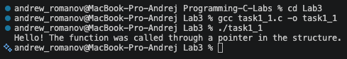
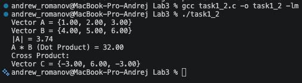
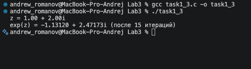
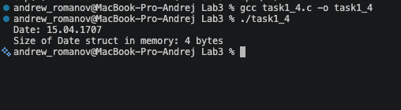
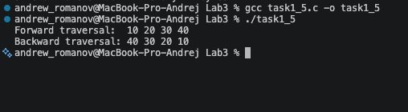
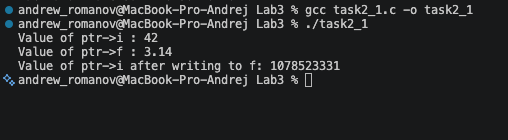
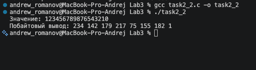
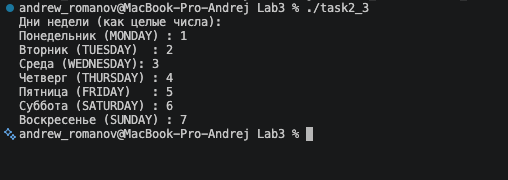
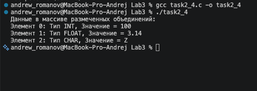

# Тема лабораторной работы: Структуры. Объединения. Перечисления.

## Задача 1.1: Указатель на функцию в структуре (task1_1.c)

**Постановка задачи**
Создать некоторую структуру с указателем на некоторую функцию в качестве поля. Вызвать эту функцию через имя переменной этой структуры и поле указателя на функцию.

**Математическая модель**
Математическая модель не требуется, так как задача направлена на работу с синтаксисом языка С (использование структур и указателей на функции).

**Список идентификаторов**
| Имя переменной | Тип данных | Смысловое обозначение |
| :--- | :--- | :--- |
| `Action` | struct | Структура, содержащая указатель на функцию |
| `actionFunc` | void (\*)(void) | Указатель на функцию без аргументов и возвращаемого значения |
| `myAction` | struct Action | Экземпляр структуры |

**Код программы**

```c
#include <stdio.h>

void printMessage(void)
{
    printf("Hello! The function was called through a pointer in the structure.\n");
}

struct Action
{
    void (*actionFunc)(void);
};

int main(void)
{
    struct Action myAction;
    myAction.actionFunc = printMessage;
    myAction.actionFunc();
    return 0;
}
```



## Задача 1.2: Вектор в 3-х мерном пространстве (task1_2.c)

**Постановка задачи**
Создать структуру для вектора в 3-х мерном пространстве. Реализовать и использовать в своей программе следующие операции над векторами:

- скалярное умножение векторов;
- векторное произведение;
- модуль вектора;
- распечатка вектора в консоли.
  В структуре вектора указать имя вектора в качестве отдельного поля этой структуры.

**Математическая модель**
Модуль вектора: $|v| = \sqrt{x^2 + y^2 + z^2}$
Скалярное произведение: $v_1 \cdot v_2 = x_1 x_2 + y_1 y_2 + z_1 z_2$
Векторное произведение: $v_1 \times v_2 = (y_1 z_2 - z_1 y_2, z_1 x_2 - x_1 z_2, x_1 y_2 - y_1 x_2)$

**Список идентификаторов**
| Имя переменной | Тип данных | Смысловое обозначение |
| :--- | :--- | :--- |
| `Vector3D` | struct | Структура трехмерного вектора |
| `name` | char | Имя вектора |
| `x, y, z` | double | Координаты вектора |
| `vA, vB, vC` | struct Vector3D | Экземпляры векторов |

**Код программы**

```c
#include <stdio.h>
#include <math.h>

struct Vector3D
{
    char name;
    double x;
    double y;
    double z;
};

void printVector(struct Vector3D v)
{
    printf("Vector %c = {%.2f, %.2f, %.2f}\n", v.name, v.x, v.y, v.z);
}

double vectorLength(struct Vector3D v)
{
    return sqrt(v.x * v.x + v.y * v.y + v.z * v.z);
}

double dotProduct(struct Vector3D v1, struct Vector3D v2)
{
    return v1.x * v2.x + v1.y * v2.y + v1.z * v2.z;
}

struct Vector3D crossProduct(struct Vector3D v1, struct Vector3D v2, char newName)
{
    struct Vector3D result;
    result.name = newName;
    result.x = v1.y * v2.z - v1.z * v2.y;
    result.y = v1.z * v2.x - v1.x * v2.z;
    result.z = v1.x * v2.y - v1.y * v2.x;
    return result;
}

int main(void)
{
    struct Vector3D vA = {'A', 1.0, 2.0, 3.0};
    struct Vector3D vB = {'B', 4.0, 5.0, 6.0};
    printVector(vA);
    printVector(vB);
    printf("|%c| = %.2f\n", vA.name, vectorLength(vA));
    printf("%c * %c (Dot Product) = %.2f\n", vA.name, vB.name, dotProduct(vA, vB));
    struct Vector3D vC = crossProduct(vA, vB, 'C');
    printf("Cross Product:\n");
    printVector(vC);
    return 0;
}
```



## Задача 1.3: Комплексная экспонента (task1_3.c)

**Постановка задачи**
Вычислить, используя структуру комплексного числа, комплексную экспоненту $exp(z)$ некоторого $z\in\mathbb{C}$.
$exp(z)=1+z+\frac{1}{2!}z^{2}+\frac{1}{3!}z^{3}+...+\frac{1}{n!}z^{n}.$.

**Математическая модель**
Разложение экспоненты в ряд Тейлора: $exp(z) = \sum_{k=0}^{n} \frac{z^k}{k!}$.
Вычисления производятся по правилам арифметики комплексных чисел (сложение, умножение и деление на действительное число).

**Список идентификаторов**
| Имя переменной | Тип данных | Смысловое обозначение |
| :--- | :--- | :--- |
| `Complex` | struct | Структура для комплексного числа |
| `real`, `imag` | double | Действительная и мнимая части |
| `z` | struct Complex | Исходное комплексное число |
| `exp_z` | struct Complex | Результат (комплексная экспонента) |
| `term` | struct Complex | Текущий член ряда Тейлора |
| `n` | int | Количество итераций для точности |

**Код программы**

```c
#include <stdio.h>

struct Complex
{
    double real;
    double imag;
};

struct Complex add(struct Complex a, struct Complex b)
{
    struct Complex res;
    res.real = a.real + b.real;
    res.imag = a.imag + b.imag;
    return res;
}

struct Complex multiply(struct Complex a, struct Complex b)
{
    struct Complex res;
    res.real = a.real * b.real - a.imag * b.imag;
    res.imag = a.real * b.imag + a.imag * b.real;
    return res;
}

struct Complex divideByScalar(struct Complex a, double scalar)
{
    struct Complex res;
    res.real = a.real / scalar;
    res.imag = a.imag / scalar;
    return res;
}

int main(void)
{
    struct Complex z = {1.0, 2.0};
    struct Complex exp_z = {1.0, 0.0};
    struct Complex term = {1.0, 0.0};

    int n = 15;

    for (int i = 1; i <= n; i++)
    {
        term = multiply(term, z);
        term = divideByScalar(term, (double)i);
        exp_z = add(exp_z, term);
    }

    printf("z = %.2f + %.2fi\n", z.real, z.imag);
    printf("exp(z) = %.5f + %.5fi (после %d итераций)\n", exp_z.real, exp_z.imag, n);

    return 0;
}
```



## Задача 1.4: Битовые поля для хранения даты (task1_4.c)

**Постановка задачи**
Используя так называемые "битовые" поля в структуре С, создать экономную структуру в оперативной памяти для заполнения даты некоторого события, например даты рождения человека.

**Математическая модель**
Для экономии памяти используются битовые поля. Для хранения дня (значения от 1 до 31) достаточно 5 бит ($2^5 = 32$). Для месяца (от 1 до 12) достаточно 4 бит ($2^4 = 16$). Для года (например, до 4095) выделяется 12 бит. Суммарно дата занимает 21 бит, что позволяет уместить всю структуру в один стандартный 32-битный `unsigned int` (4 байта).

**Список идентификаторов**
| Имя переменной | Тип данных | Смысловое обозначение |
| :--- | :--- | :--- |
| `Date` | struct | Структура для экономного хранения даты |
| `day` | unsigned int : 5 | День (битовое поле на 5 бит) |
| `month` | unsigned int : 4 | Месяц (битовое поле на 4 бита) |
| `year` | unsigned int : 12 | Год (битовое поле на 12 бит) |
| `myDate` | struct Date | Экземпляр структуры |

**Код программы**

```c
#include <stdio.h>

struct Date
{
    unsigned int day : 5;
    unsigned int month : 4;
    unsigned int year : 12;
};

int main(void)
{
    struct Date myDate;
    myDate.day = 15;
    myDate.month = 4;
    myDate.year = 1707;
    printf("Date: %02u.%02u.%u\n", myDate.day, myDate.month, myDate.year);
    printf("Size of Date struct in memory: %lu bytes\n", sizeof(struct Date));
    return 0;
}
```



## Задача 1.5: Двунаправленный связный список (task1_5.c)

**Постановка задачи**
Реализовать в виде структур двунаправленный связный список и совершить отдельно его обход в прямом и обратном направлениях с распечаткой значений каждого элемента списка.

**Математическая модель**
Связанный список представляется в памяти как набор независимых узлов. Для двунаправленного списка каждый узел имеет структуру, содержащую информационное поле (данные) и два указателя: на предыдущий и следующий узлы. Обход осуществляется последовательным переходом по указателям `next` (для прямого обхода) и `prev` (для обратного).

**Список идентификаторов**
| Имя переменной | Тип данных | Смысловое обозначение |
| :--- | :--- | :--- |
| `Node` | struct | Узел двунаправленного списка |
| `data` | int | Данные узла |
| `prev`, `next` | struct Node* | Указатели на предыдущий и следующий узлы |
| `head` | struct Node* | Указатель на начало списка |
| `newNode`, `last`, `temp` | struct Node\* | Вспомогательные указатели для добавления и обхода |

**Код программы**

```c
#include <stdio.h>
#include <stdlib.h>

// Структура для узла двунаправленного связного списка
struct Node
{
    int data;
    struct Node *prev;
    struct Node *next;
};

// Функция для добавления узла в конец списка
struct Node *append(struct Node *head, int newData)
{
    struct Node *newNode = (struct Node *)malloc(sizeof(struct Node));
    struct Node *last = head;

    newNode->data = newData;
    newNode->next = NULL;

    if (head == NULL)
    {
        newNode->prev = NULL;
        return newNode;
    }

    while (last->next != NULL)
    {
        last = last->next;
    }

    last->next = newNode;
    newNode->prev = last;

    return head;
}

// Прямой обход списка
void printForward(struct Node *node)
{
    printf("Forward traversal:  ");
    while (node != NULL)
    {
        printf("%d ", node->data);
        node = node->next;
    }
    printf("\n");
}

// Обратный обход списка
void printBackward(struct Node *node)
{
    struct Node *last = node;
    if (node == NULL)
        return;

    while (last->next != NULL)
    {
        last = last->next;
    }

    printf("Backward traversal: ");
    while (last != NULL)
    {
        printf("%d ", last->data);
        last = last->prev;
    }
    printf("\n");
}

// Освобождение выделенной памяти
void freeList(struct Node *node)
{
    struct Node *temp;
    while (node != NULL)
    {
        temp = node;
        node = node->next;
        free(temp);
    }
}

int main(void)
{
    struct Node *head = NULL;

    // Заполнение списока числами
    head = append(head, 10);
    head = append(head, 20);
    head = append(head, 30);
    head = append(head, 40);

    // Вывод значений в обоих направлениях
    printForward(head);
    printBackward(head);

    // Очищистка памяти
    freeList(head);

    return 0;
}
```



## Задача 2.1: Указатель на объединение union (task2_1.c)

**Постановка задачи**
Напишите программу, которая использует указатель на некоторое объединение union.

**Математическая модель**
Объединение (`union`) позволяет хранить различные типы данных в одной и той же области памяти. Размер объединения равен размеру его самого большого элемента. Доступ к элементам объединения через указатель осуществляется с помощью оператора `->`.

**Список идентификаторов**
| Имя переменной | Тип данных | Смысловое обозначение |
| :--- | :--- | :--- |
| `Data` | union | Объединение для целого и вещественного числа |
| `i` | int | Поле целого типа |
| `f` | float | Поле вещественного типа |
| `myData` | union Data | Экземпляр объединения |
| `ptr` | union Data\* | Указатель на объединение |

**Код программы**

```c
#include <stdio.h>

union Data
{
    int i;
    float f;
};

int main(void)
{
    union Data myData;
    union Data *ptr = &myData;

    ptr->i = 42;
    printf("Value of ptr->i : %d\n", ptr->i);
    ptr->f = 3.14f;
    printf("Value of ptr->f : %.2f\n", ptr->f);
    printf("Value of ptr->i after writing to f: %d\n", ptr->i);

    return 0;
}
```



## Задача 2.2: Побайтовая распечатка unsigned long (task2_2.c)

**Постановка задачи**
Напишите программу, которая использует union для побайтовой распечатки типа unsigned long.

**Математическая модель**
Объединение (`union`) используется для наложения друг на друга переменной типа `unsigned long` и массива `unsigned char` того же размера. Поскольку они занимают одну и ту же область памяти, запись числа в переменную `value` позволяет прочитать его побайтово через элементы массива `bytes`.

**Список идентификаторов**
| Имя переменной | Тип данных | Смысловое обозначение |
| :--- | :--- | :--- |
| `BytePrinter` | union | Объединение для побайтового доступа |
| `value` | unsigned long | Переменная для хранения большого числа |
| `bytes` | unsigned char[] | Массив для доступа к отдельным байтам |
| `printer` | union BytePrinter | Экземпляр объединения |
| `i` | int | Счётчик цикла |

**Код программы**

```c
#include <stdio.h>

union BytePrinter
{
    unsigned long value;
    unsigned char bytes[sizeof(unsigned long)];
};

int main(void)
{
    union BytePrinter printer;

    printer.value = 123456789876543210UL;

    printf("Значение: %lu\n", printer.value);
    printf("Побайтовый вывод: ");

    for (int i = 0; i < sizeof(unsigned long); i++)
    {
        printf("%u ", printer.bytes[i]);
    }
    printf("\n");

    return 0;
}
```



## Задача 2.3: Перечислимый тип данных (task2_3.c)

**Постановка задачи**
Создайте перечислимый тип данных (enum) для семи дней недели и распечатайте на экране его значения, как целые числа.

**Математическая модель**
Модель не требуется. Задача направлена на изучение синтаксиса перечислений (`enum`) в языке С. Перечисление автоматически присваивает целые значения своим константам, начиная с заданного (или с 0 по умолчанию).

**Список идентификаторов**
| Имя переменной | Тип данных | Смысловое обозначение |
| :--- | :--- | :--- |
| `DaysOfWeek` | enum | Перечислимый тип для дней недели |
| `MONDAY`...`SUNDAY` | int (константы) | Дни недели со значениями от 1 до 7 |

**Код программы**

```c
#include <stdio.h>

enum DaysOfWeek
{
    MONDAY = 1,
    TUESDAY,
    WEDNESDAY,
    THURSDAY,
    FRIDAY,
    SATURDAY,
    SUNDAY
};

int main(void)
{
    printf("Дни недели (как целые числа):\n");
    printf("Понедельник (MONDAY) : %d\n", MONDAY);
    printf("Вторник (TUESDAY)  : %d\n", TUESDAY);
    printf("Среда (WEDNESDAY): %d\n", WEDNESDAY);
    printf("Четверг (THURSDAY) : %d\n", THURSDAY);
    printf("Пятница (FRIDAY)   : %d\n", FRIDAY);
    printf("Суббота (SATURDAY) : %d\n", SATURDAY);
    printf("Воскресенье (SUNDAY) : %d\n", SUNDAY);

    return 0;
}
```



## Задача 2.4: Размеченное объединение (task2_4.c)

**Постановка задачи**
Создайте так называемое размеченное объединение `union`, которое заключено в виде поля структуры `struct` вместе с ещё одним полем, которое является перечислением `enum` и служит индикатором того, что именно на текущий момент хранится в таком вложенном объединении. Создать и заполнить динамический массив таких структур с объединениями внутри, заполняя вспомогательное поле перечисления `enum` для сохранения информации о хранимом в каждом размеченном объединении типе данных. Реализовать распечатку данных массива таких структур в консоль.

**Математическая модель**
Размеченное объединение (Tagged Union) позволяет безопасно работать с объединениями, так как поле `type` (перечисление) всегда указывает, какой именно тип данных (целое число, вещественное число или символ) в данный момент записан в общую память `union`. Для хранения набора таких структур используется динамический массив, память под который выделяется с помощью `malloc` и освобождается с помощью `free`.

**Список идентификаторов**
| Имя переменной | Тип данных | Смысловое обозначение |
| :--- | :--- | :--- |
| `DataType` | enum | Перечисление возможных типов данных |
| `TaggedData` | struct | Структура с индикатором типа и объединением |
| `type` | enum DataType | Индикатор текущего типа данных |
| `data` | union | Объединение для хранения самого значения |
| `arr` | struct TaggedData\* | Динамический массив размеченных объединений |
| `n` | int | Количество элементов в массиве |
| `i` | int | Счётчик цикла |

**Код программы**

```c
#include <stdio.h>
#include <stdlib.h>

enum DataType
{
    TYPE_INT,
    TYPE_FLOAT,
    TYPE_CHAR
};

struct TaggedData
{
    enum DataType type;
    union
    {
        int i;
        float f;
        char c;
    } data;
};

int main(void)
{
    int n = 3;

    struct TaggedData *arr = (struct TaggedData *)malloc((size_t)n * sizeof(struct TaggedData));
    if (arr == NULL)
    {
        printf("Ошибка выделения памяти\n");
        return 1;
    }

    arr[0].type = TYPE_INT;
    arr[0].data.i = 100;

    arr[1].type = TYPE_FLOAT;
    arr[1].data.f = 3.14f;

    arr[2].type = TYPE_CHAR;
    arr[2].data.c = 'Z';

    printf("Данные в массиве размеченных объединений:\n");
    for (int i = 0; i < n; i++)
    {
        printf("Элемент %d: ", i);

        switch (arr[i].type)
        {
        case TYPE_INT:
            printf("Тип INT, Значение = %d\n", arr[i].data.i);
            break;
        case TYPE_FLOAT:
            printf("Тип FLOAT, Значение = %.2f\n", arr[i].data.f);
            break;
        case TYPE_CHAR:
            printf("Тип CHAR, Значение = %c\n", arr[i].data.c);
            break;
        }
    }

    free(arr);

    return 0;
}
```



## Информация о студенте

Зубанов Андрей, 1 курс, группа ИВТ.
