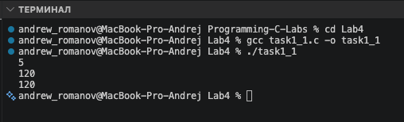
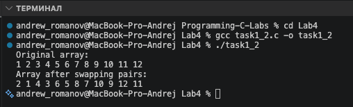
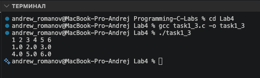
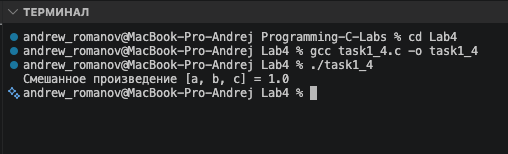
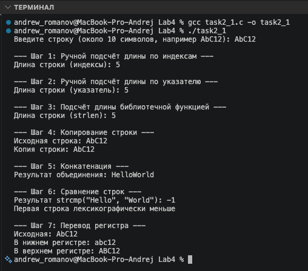
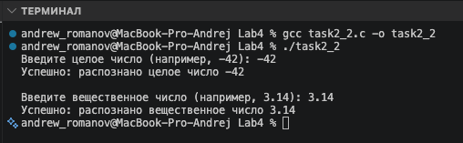
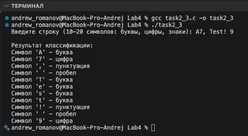

# Тема лабораторной работы: Введение в функции. Базовая работа со строками

## Задача 1.1: Факториал: цикл и рекурсия (task1_1.c)

**Постановка задачи**
Реализовать и сравнить два способа вычисления факториала: итеративный и рекурсивный. На вход подать целое число $n \ge 0$. Обе функции для одного и того же $n$ должны давать одинаковый ответ. Должен быть корректно обработан случай $n=0$ (факториал равен 1).

**Математическая модель**
Факториал числа $n$ (обозначается $n!$) вычисляется следующим образом:

- Итеративно: $n! = 1 \cdot 2 \cdot 3 \cdot \dots \cdot n$ (при $n \ge 1$), $0! = 1$.
- Рекурсивно: $n! = n \cdot (n-1)!$ (при $n \ge 1$), $0! = 1$ (базовый случай).

**Список идентификаторов**
| Имя переменной | Тип данных | Смысловое обозначение |
| :--- | :--- | :--- |
| `n` | int | Входное число для вычисления факториала |
| `i` | int | Счётчик цикла |
| `result` | int | Переменная для накопления результата в цикле |

**Код программы**

```c
#include <stdio.h>

int factorial_iter(int n)
{
    if (n <= 1)
    {
        return 1;
    }
    int result = 1;
    for (int i = 2; i <= n; i++)
    {
        result *= i;
    }
    return result;
}

int factorial_rec(int n)
{
    if (n <= 1)
    {
        return 1;
    }
    return n * factorial_rec(n - 1);
}

int main(void)
{
    int n;

    if (scanf("%d", &n) == 1 && n >= 0)
    {
        printf("%d\n", factorial_iter(n));
        printf("%d\n", factorial_rec(n));
    }

    return 0;
}
```



## Задача 1.2: Обмен чётных/нечётных ячеек массива (task1_2.c)

**Постановка задачи**
Отработать передачу динамического массива в функцию и изменение данных "по месту". На вход подать динамический массив int из 12 элементов. Функция должна делать попарный обмен соседних элементов: индексы 0<->1, 2<->3, 4<->5, ..., 10<->11. При этом размер массива не меняется, а перестановка выполняется только внутри каждой пары.

**Математическая модель**
Обход элементов массива осуществляется в цикле с шагом 2. Для обмена значений соседних ячеек массива (с индексами `i` и `i+1`) используется вспомогательная переменная `temp`: `temp = arr[i]; arr[i] = arr[i+1]; arr[i+1] = temp;`.

**Список идентификаторов**
| Имя переменной | Тип данных | Смысловое обозначение |
| :--- | :--- | :--- |
| `arr` | int\* | Указатель на динамический массив |
| `size`, `n` | size_t | Размер массива (количество элементов) |
| `i` | size_t | Счётчик цикла |
| `temp` | int | Временная переменная для обмена значений |

**Код программы**

```c
#include <stdio.h>
#include <stdlib.h>

void swapPairs(int *arr, size_t size)
{
    for (size_t i = 0; i + 1 < size; i += 2)
    {
        int temp = arr[i];
        arr[i] = arr[i + 1];
        arr[i + 1] = temp;
    }
}

void printArray(const int *arr, size_t size)
{
    for (size_t i = 0; i < size; i++)
    {
        printf("%d ", arr[i]);
    }
    printf("\n");
}

int main(void)
{
    size_t n = 12;

    int *arr = (int *)malloc(n * sizeof(int));
    if (arr == NULL)
    {
        printf("Memory allocation error\n");
        return 1;
    }

    for (size_t i = 0; i < n; i++)
    {
        arr[i] = (int)(i + 1);
    }

    printf("Original array:\n");
    printArray(arr, n);

    swapPairs(arr, n);

    printf("Array after swapping pairs:\n");
    printArray(arr, n);

    free(arr);

    return 0;
}
```



## Задача 1.3: Набор функций для матрицы double (task1_3.c)

**Постановка задачи**
Выделять, заполнять, печатать и освобождать двумерный динамический массив без утечек памяти. На вход подаются размеры матрицы (rows, cols) и значения элементов. Если на этапе выделения памяти под одну из строк возникает ошибка, необходимо освободить уже выделенные строки и вернуть признак ошибки.

**Математическая модель**
Двумерный массив (матрица) размером $rows \times cols$ представляется в памяти как массив указателей типа `double*`, где каждый элемент указывает на начало одномерного массива (строки). Доступ к элементу осуществляется с помощью двойной индексации: `matrix[i][j]`. При ошибке выделения памяти применяется обратный цикл очистки уже выделенных строк.

**Список идентификаторов**
| Имя переменной | Тип данных | Смысловое обозначение |
| :--- | :--- | :--- |
| `matrix` | double\*\* | Указатель на массив указателей (матрица) |
| `rows`, `cols` | size_t | Количество строк и столбцов матрицы |
| `i`, `j` | size_t | Счётчики циклов для строк и столбцов |

**Код программы**

```c
#include <stdio.h>
#include <stdlib.h>

// 1. Функция выделения памяти
double **allocate_matrix(size_t rows, size_t cols)
{
    double **matrix = (double **)malloc(rows * sizeof(double *));
    if (matrix == NULL)
    {
        return NULL;
    }

    for (size_t i = 0; i < rows; i++)
    {
        matrix[i] = (double *)malloc(cols * sizeof(double));
        if (matrix[i] == NULL)
        {
            for (size_t j = 0; j < i; j++)
            {
                free(matrix[j]);
            }
            free(matrix);
            return NULL;
        }
    }
    return matrix;
}

// 2. Функция освобождения памяти
void free_matrix(double **matrix, size_t rows)
{
    if (matrix != NULL)
    {
        for (size_t i = 0; i < rows; i++)
        {
            free(matrix[i]);
        }
        free(matrix);
    }
}

// 3. Функция заполнения матрицы
void fill_matrix(double **matrix, size_t rows, size_t cols)
{
    for (size_t i = 0; i < rows; i++)
    {
        for (size_t j = 0; j < cols; j++)
        {
            scanf("%lf", &matrix[i][j]);
        }
    }
}

// 4. Функция печати матрицы
void print_matrix(double **matrix, size_t rows, size_t cols)
{
    for (size_t i = 0; i < rows; i++)
    {
        for (size_t j = 0; j < cols; j++)
        {
            printf("%.1lf ", matrix[i][j]);
        }
        printf("\n");
    }
}

int main(void)
{
    size_t rows = 2;
    size_t cols = 3;

    double **matrix = allocate_matrix(rows, cols);
    if (matrix == NULL)
    {
        printf("Memory allocation error\n");
        return 1;
    }

    fill_matrix(matrix, rows, cols);

    print_matrix(matrix, rows, cols);

    free_matrix(matrix, rows);

    return 0;
}
```



## Задача 1.4: Смешанное произведение трёх векторов в 3D (task1_4.c)

**Постановка задачи**
Вычислять смешанное произведение через разбиение задачи на небольшие понятные функции. Реализовать функции векторного произведения (`cross3`), скалярного произведения (`dot3`) и смешанного произведения (`triple3`), использующую две предыдущие функции.

**Математическая модель**
Смешанное произведение трёх векторов $a, b, c$ вычисляется как скалярное произведение вектора $a$ на векторное произведение векторов $b$ и $c$: $[a, b, c] = a \cdot (b \times c)$.
Векторное произведение: $b \times c = (b_y c_z - b_z c_y, b_z c_x - b_x c_z, b_x c_y - b_y c_x)$.
Скалярное произведение: $a \cdot tmp = a_x tmp_x + a_y tmp_y + a_z tmp_z$.

**Список идентификаторов**
| Имя переменной | Тип данных | Смысловое обозначение |
| :--- | :--- | :--- |
| `a, b, c` | double[3] | Исходные трёхмерные векторы |
| `out` | double[3] | Результирующий вектор в функции cross3 |
| `tmp` | double[3] | Промежуточный вектор (результат b x c) |
| `result` | double | Значение смешанного произведения |

**Код программы**

```c
#include <stdio.h>

void cross3(const double a[3], const double b[3], double out[3])
{
    out[0] = a[1] * b[2] - a[2] * b[1];
    out[1] = a[2] * b[0] - a[0] * b[2];
    out[2] = a[0] * b[1] - a[1] * b[0];
}

double dot3(const double a[3], const double b[3])
{
    return a[0] * b[0] + a[1] * b[1] + a[2] * b[2];
}

double triple3(const double a[3], const double b[3], const double c[3])
{
    double tmp[3];
    cross3(b, c, tmp);
    return dot3(a, tmp);
}

int main(void)
{
    double a[3] = {1.0, 0.0, 0.0};
    double b[3] = {0.0, 1.0, 0.0};
    double c[3] = {0.0, 0.0, 1.0};

    double result = triple3(a, b, c);

    printf("Смешанное произведение [a, b, c] = %.1lf\n", result);

    return 0;
}
```



## Задача 2.1: Базовые строковые операции (task2_1.c)

**Постановка задачи**
Освоить базовые операции с С-строкой в пошаговом режиме (подсчет длины разными способами, копирование, конкатенация, сравнение, изменение регистра). На вход подается строка длиной около 10 латинских символов. Необходимо выполнить 7 шагов базовых строковых операций.

**Математическая модель**
Для работы со строками используются библиотечные функции из `<string.h>` и `<ctype.h>`, а также ручной обход массива символов в цикле (по индексам и с использованием указателей) до достижения нулевого символа `\0`. Конкатенация, копирование и сравнение выполняются как встроенными средствами, так и с пониманием работы памяти. При смене регистра происходит безопасное приведение символа к типу `unsigned char`.

**Список идентификаторов**
| Имя переменной | Тип данных | Смысловое обозначение |
| :--- | :--- | :--- |
| `my_string` | char[] | Исходная строка (буфер ввода) |
| `len`, `len1`, `len2`, `len3` | size_t | Переменные для хранения длины строки |
| `p` | char\* | Указатель для обхода строки |
| `copy` | char[] | Буфер для копии строки |
| `concat_buf` | char[] | Буфер для конкатенации |
| `cmp_res` | int | Результат сравнения строк |
| `lower_str`, `upper_str` | char[] | Строки в нижнем и верхнем регистрах |
| `c` | unsigned char | Текущий символ для смены регистра |

**Код программы**

```c
#include <stdio.h>
#include <string.h>
#include <ctype.h>

#define MY_SIZE 32

int main(void)
{
    char my_string[MY_SIZE];

    printf("Введите строку (около 10 символов, например AbC12): ");
    if (fgets(my_string, sizeof(my_string), stdin))
    {

        size_t len = strlen(my_string);
        if (len > 0 && my_string[len - 1] == '\n')
        {
            my_string[len - 1] = '\0';
        }

        printf("\n--- Шаг 1: Ручной подсчёт длины по индексам ---\n");
        size_t len1 = 0;
        for (size_t i = 0; my_string[i] != '\0'; i++)
        {
            len1++;
        }
        printf("Длина строки (индексы): %zu\n", len1);

        printf("\n--- Шаг 2: Ручной подсчёт длины по указателю ---\n");
        size_t len2 = 0;
        char *p = my_string;
        while (*p != '\0')
        {
            len2++;
            p++;
        }
        printf("Длина строки (указатель): %zu\n", len2);

        printf("\n--- Шаг 3: Подсчёт длины библиотечной функцией ---\n");
        size_t len3 = strlen(my_string);
        printf("Длина строки (strlen): %zu\n", len3);

        printf("\n--- Шаг 4: Копирование строки ---\n");
        char copy[MY_SIZE];
        strcpy(copy, my_string);
        printf("Исходная строка: %s\n", my_string);
        printf("Копия строки: %s\n", copy);

        printf("\n--- Шаг 5: Конкатенация ---\n");
        char concat_buf[MY_SIZE * 2] = "Hello";
        strcat(concat_buf, "World");
        printf("Результат объединения: %s\n", concat_buf);

        printf("\n--- Шаг 6: Сравнение строк ---\n");
        int cmp_res = strcmp("Hello", "World");
        printf("Результат strcmp(\"Hello\", \"World\"): %d\n", cmp_res);
        if (cmp_res < 0)
        {
            printf("Первая строка лексикографически меньше\n");
        }
        else if (cmp_res == 0)
        {
            printf("Строки равны\n");
        }
        else
        {
            printf("Первая строка больше\n");
        }

        printf("\n--- Шаг 7: Перевод регистра ---\n");
        char lower_str[MY_SIZE];
        char upper_str[MY_SIZE];

        for (size_t i = 0; my_string[i] != '\0'; i++)
        {
            unsigned char c = (unsigned char)my_string[i];
            lower_str[i] = (char)tolower(c);
            upper_str[i] = (char)toupper(c);
        }

        lower_str[len3] = '\0';
        upper_str[len3] = '\0';

        printf("Исходная: %s\n", my_string);
        printf("В нижнем регистре: %s\n", lower_str);
        printf("В верхнем регистре: %s\n", upper_str);
    }

    return 0;
}
```



## Задача 2.2: Конвертация строк в числа (task2_2.c)

**Постановка задачи**
Безопасно преобразовывать текст в `int` (в коде используется `long`) и `double`, чтобы программа корректно реагировала на ошибочный ввод. Для целого числа использовать `strtol`, для вещественного — `strtod`. Перед преобразованием обнулять `errno`. После преобразования проверять: распознан ли хотя бы один числовой символ, не произошло ли переполнение диапазона (`ERANGE`), и не остались ли лишние символы после числа.

**Математическая модель**
Преобразование строкового представления числа в машинный числовой формат (`long` и `double`). Для безопасного преобразования используются библиотечные функции `strtol` и `strtod`, которые принимают строку и возвращают само число, а также устанавливают указатель `endptr` на первый нераспознанный символ (что позволяет выявлять лишний текст после числа). Ошибки переполнения отслеживаются через системную переменную `errno`.

**Список идентификаторов**
| Имя переменной | Тип данных | Смысловое обозначение |
| :--- | :--- | :--- |
| `int_str` | char[] | Буфер для ввода строки с целым числом |
| `double_str` | char[] | Буфер для ввода строки с вещественным числом |
| `endptr` | char\* | Указатель на первый нераспознанный символ |
| `int_val` | long | Результат преобразования в целое число |
| `double_val` | double | Результат преобразования в вещественное число |

**Код программы**

```c
#include <stdio.h>
#include <stdlib.h>
#include <errno.h>

int main(void)
{
    char int_str[64];
    char double_str[64];

    // Обработка целого числа
    printf("Введите целое число (например, -42): ");
    if (fgets(int_str, sizeof(int_str), stdin))
    {
        char *endptr;
        errno = 0;

        long int_val = strtol(int_str, &endptr, 10);

        if (endptr == int_str)
        {
            printf("Ошибка: не распознано ни одной цифры для целого числа.\n");
        }
        else if (errno == ERANGE)
        {
            printf("Ошибка: произошло переполнение диапазона (ERANGE).\n");
        }
        else
        {
            if (*endptr != '\0' && *endptr != '\n')
            {
                printf("Предупреждение: обнаружены лишние символы после целого числа ('%s').\n", endptr);
            }
            printf("Успешно: распознано целое число %ld\n", int_val);
        }
    }

    // Обработка вещественного числа
    printf("\nВведите вещественное число (например, 3.14): ");
    if (fgets(double_str, sizeof(double_str), stdin))
    {
        char *endptr;
        errno = 0;

        double double_val = strtod(double_str, &endptr);

        if (endptr == double_str)
        {
            printf("Ошибка: не распознано ни одной цифры для вещественного числа.\n");
        }
        else if (errno == ERANGE)
        {
            printf("Ошибка: произошло переполнение диапазона (ERANGE).\n");
        }
        else
        {
            if (*endptr != '\0' && *endptr != '\n')
            {
                printf("Предупреждение: обнаружены лишние символы после вещественного числа ('%s').\n", endptr);
            }
            printf("Успешно: распознано вещественное число %.2f\n", double_val);
        }
    }

    return 0;
}
```



## Задача 2.3: Классификация символов (task2_3.c)

**Постановка задачи**
Научиться классифицировать каждый символ строки с помощью функций из `ctype.h`. На вход подается строка длиной 10-20 символов (цифры, латиница, пробелы, знаки пунктуации). Необходимо организовать цикл по всем символам до NUL и для каждого проверить его свойства (`isdigit`, `isalpha`, `isspace`, `ispunct`), сформировав строку отчёта в понятном виде. При вызове функций проверки символ необходимо приводить к `unsigned char` во избежание неопределённого поведения.

**Математическая модель**
Строка обходится посимвольно в цикле `for` от нулевого индекса до достижения нуль-терминатора `\0`. Для классификации каждого символа используются библиотечные функции предиката (`isalpha`, `isdigit`, `isspace`, `ispunct`), которые возвращают ненулевое значение (истину), если символ принадлежит к указанной группе. Для безопасной обработки текущий символ предварительно явно приводится к типу `unsigned char`.

**Список идентификаторов**
| Имя переменной | Тип данных | Смысловое обозначение |
| :--- | :--- | :--- |
| `str` | char[] | Буфер для ввода исходной строки |
| `len` | size_t | Длина строки (используется для удаления переноса каретки) |
| `i` | size_t | Счётчик цикла для посимвольного обхода |
| `c` | unsigned char | Текущий символ для безопасной передачи в функции классификации |

**Код программы**

```c
#include <stdio.h>
#include <ctype.h>
#include <string.h>

int main(void)
{
    char str[64];

    printf("Введите строку (10-20 символов: буквы, цифры, знаки): ");
    if (fgets(str, sizeof(str), stdin))
    {
        size_t len = strlen(str);
        if (len > 0 && str[len - 1] == '\n')
        {
            str[len - 1] = '\0';
        }

        printf("\nРезультат классификации:\n");
        for (size_t i = 0; str[i] != '\0'; i++)
        {
            unsigned char c = (unsigned char)str[i];

            printf("Символ '%c' - ", c);

            if (isalpha(c))
            {
                printf("буква\n");
            }
            else if (isdigit(c))
            {
                printf("цифра\n");
            }
            else if (isspace(c))
            {
                printf("пробел\n");
            }
            else if (ispunct(c))
            {
                printf("пунктуация\n");
            }
            else
            {
                printf("другой символ\n");
            }
        }
    }

    return 0;
}
```



## Информация о студенте

Зубанов Андрей, 1 курс, группа ИВТ.
